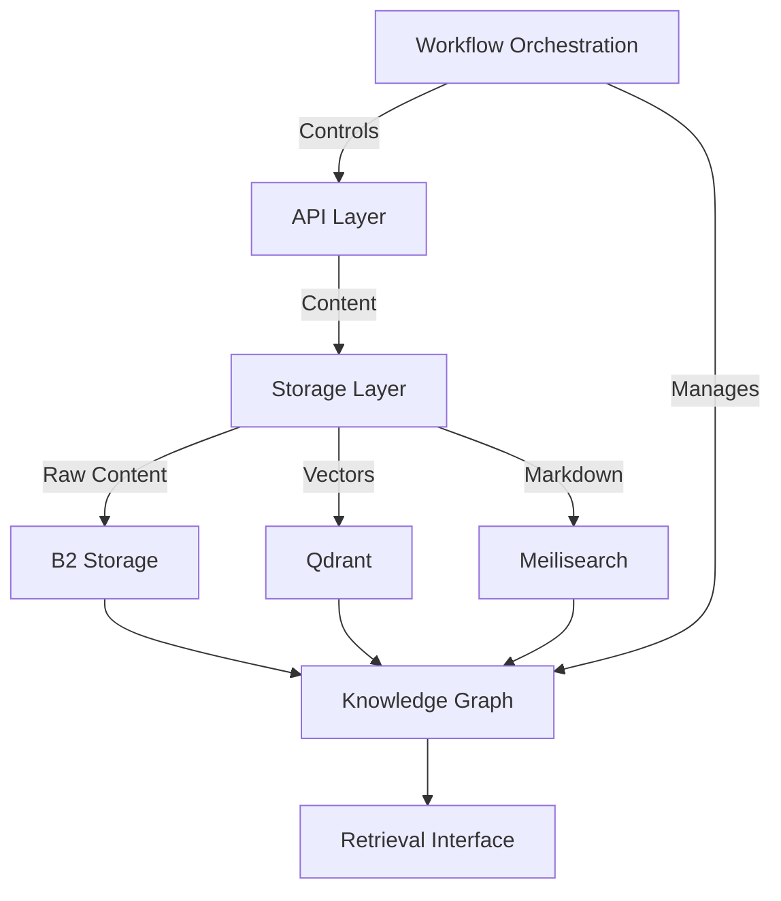

# Knowledge Retrieval System Architecture Documentation
*Created: April 20, 2024*

## Purpose of this Document
This document serves as a comprehensive record of the architectural decisions, discussions, and implementation plans for the Knowledge Retrieval System (KRS). It captures the evolution of the project from its initial state as a Decision Support System (DSS) to its current focus on knowledge retrieval and management.

## Document Structure
1. [Project Evolution](#project-evolution)
2. [System Architecture](#system-architecture)
3. [Storage Layer Design](#storage-layer-design)
4. [Knowledge Graph Integration](#knowledge-graph-integration)
5. [Workflow Orchestration](#workflow-orchestration)
6. [Implementation Examples](#implementation-examples)
7. [Next Steps](#next-steps)

## Project Evolution
### Initial State
- Project started as a Decision Support System (DSS) focused on Supply Chain Management
- Integrated LLMs and AI agent networks
- Included literature review, keyword analysis, and clustering capabilities

### Current Direction
- Shifted focus to Knowledge Retrieval System (KRS)
- Emphasis on information retrieval, storage, and management
- Integration of multiple storage solutions and knowledge representation

## System Architecture

### Core Components
1. **API Integration Layer**
   - Abstract base class for API clients
   - Implementations for SpringerNature, CORE, and future APIs
   - Standardized interface for content retrieval

2. **Storage Layer**
   - Backblaze B2: Object storage for raw content
   - Qdrant: Vector storage for semantic search
   - Meilisearch: Markdown content and metadata storage

3. **Knowledge Graph (Neo4j)**
   - Entity and relationship management
   - Citation networks
   - Concept relationships
   - Temporal tracking

4. **Context Management**
   - Hierarchical context structure
   - Context merging capabilities
   - Context chain tracking

5. **Workflow Orchestration**
   - Based on smolagents framework
   - Modular agent design
   - Flexible workflow definitions

### Integration Architecture


## Storage Layer Design

### Backblaze B2 Integration
- Stores raw content (PDFs, documents)
- Maintains original file formats
- Provides direct access to source materials

### Qdrant Vector Storage
- Stores document embeddings
- Enables semantic search
- Supports hybrid search (vector + keyword)
- Features:
  - Filtering
  - Payload storage
  - Point updates
  - Batch operations
  - Clustering
  - Quantization

### Meilisearch Integration
- Stores processed markdown content
- Full-text search capabilities
- Metadata management
- Fast retrieval and filtering

## Knowledge Graph Integration

### Role in the System
1. **Semantic Relationships & Context**
   - Document relationships
   - Concept connections
   - Citation networks
   - Temporal tracking

2. **Integration with Storage Layers**
   - Enriches retrieval with context
   - Maintains provenance
   - Enables complex queries
   - Supports discovery

### Implementation Examples

#### Case 1: Research Paper Analysis
```python
class ResearchGraphManager:
    async def process_paper(self, paper_id: str, content: Dict):
        # Create paper node
        await self.create_entity({
            'id': paper_id,
            'type': 'Paper',
            'title': content['title'],
            'year': content['year'],
            'doi': content['doi']
        })
        
        # Store in different storage layers
        await self.b2_storage.upload(content['pdf_content'], f"papers/{paper_id}.pdf")
        await self.meilisearch.index('papers').add_documents([{
            'id': paper_id,
            'content': self.process_to_markdown(content),
            'metadata': content['metadata']
        }])
        
        # Create citation relationships
        for citation in content['citations']:
            await self.create_relationship(
                from_id=paper_id,
                to_id=citation['id'],
                relationship_type='CITES',
                properties={'context': citation['context']}
            )
```

#### Case 2: Concept Extraction
```python
class ConceptGraphManager:
    async def extract_and_link_concepts(self, paper_id: str):
        paper = await self.meilisearch.index('papers').get_document(paper_id)
        concepts = self.concept_extractor.extract(paper['content'])
        
        for concept in concepts:
            concept_id = await self.create_entity({
                'id': f"concept_{concept['id']}",
                'type': 'Concept',
                'name': concept['name'],
                'category': concept['category']
            })
            
            await self.create_relationship(
                from_id=paper_id,
                to_id=concept_id,
                relationship_type='DISCUSSES',
                properties={
                    'relevance_score': concept['relevance'],
                    'context': concept['context']
                }
            )
```

## Workflow Orchestration

### Agent Framework Selection
- Chose smolagents over Google's A2A for:
  - Lightweight implementation
  - Better Hugging Face integration
  - Simpler extension model
  - Research-focused capabilities

### Implementation Structure
```python
class ResearchAgent(Agent):
    def __init__(self):
        super().__init__()
        self.tools = [
            Tool("search", self.search),
            Tool("analyze", self.analyze),
            Tool("summarize", self.summarize)
        ]

class WorkflowOrchestrator:
    def __init__(self):
        self.agents = {
            'researcher': ResearchAgent(),
            'analyzer': AnalysisAgent(),
            'writer': WritingAgent()
        }
        self.workflows = {}
```

## Next Steps

### Immediate Tasks
1. Implement base API client interface
2. Set up storage layer integrations
3. Initialize Neo4j knowledge graph
4. Develop basic workflow orchestration

### Future Considerations
1. Additional API integrations
2. Advanced knowledge graph queries
3. Enhanced context management
4. Workflow optimization
5. Performance tuning

## Contributing
This document should be updated as new decisions are made or architecture evolves. When making changes:
1. Add new sections as needed
2. Update timestamps for modified sections
3. Maintain clear documentation of decisions and rationale
4. Include code examples for new features

## References
- [smolagents Documentation](https://github.com/IlyaGusev/holosophos)
- [Google A2A Protocol](https://github.com/google/A2A)
- [Neo4j Documentation](https://neo4j.com/docs/)
- [Qdrant Documentation](https://qdrant.tech/documentation/)
- [Meilisearch Documentation](https://docs.meilisearch.com/) 