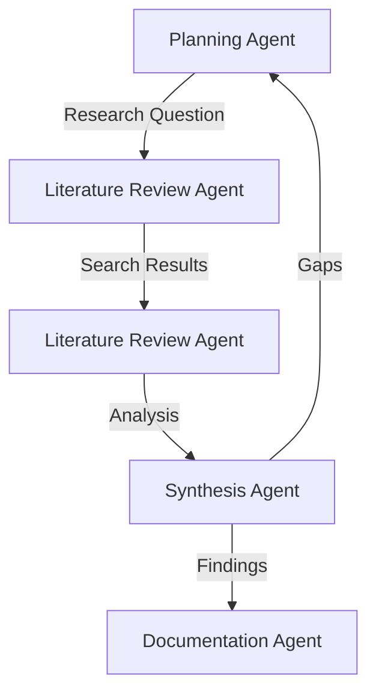
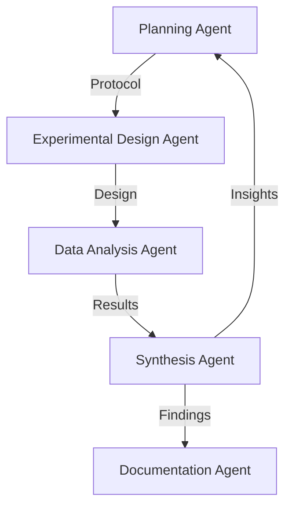
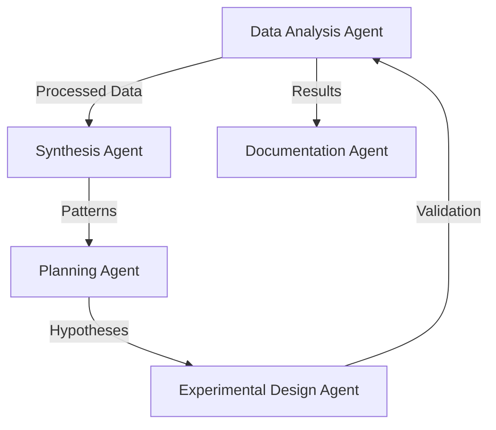

# Agent System Documentation

## Overview
This document details the agent system architecture, including agent roles, capabilities, and communication patterns for the Research Assistant's multi-agent system.

## Version Information
- Version: 1.0.0
- Last Updated: 2024-04-28
- Status: Active Development

## Agent Roles and Responsibilities

### 1. Planning Agent
**Primary Responsibilities:**
- Research question formulation
- Methodology selection
- Gap analysis
- Strategy generation
- Resource allocation

**Key Capabilities:**
- Literature synthesis
- Research methodology expertise
- Strategic planning
- Resource optimization

**Communication Channels:**
- Direct communication with all other agents
- Research context updates
- Strategy adjustments
- Resource allocation requests

### 2. Literature Review Agent
**Primary Responsibilities:**
- Scientific literature search
- Paper analysis and extraction
- Citation tracking
- Research landscape mapping
- Knowledge gap identification

**Key Capabilities:**
- Semantic search
- Document analysis
- Citation management
- Trend analysis
- Knowledge synthesis

**Communication Channels:**
- Literature updates to Planning Agent
- Citation data to Documentation Agent
- Research gaps to Synthesis Agent
- Search results to all agents

### 3. Experimental Design Agent
**Primary Responsibilities:**
- Protocol development
- Parameter optimization
- Control condition design
- Methodology validation
- Reproducibility assurance

**Key Capabilities:**
- Experimental design
- Statistical analysis
- Protocol validation
- Resource optimization
- Error handling

**Communication Channels:**
- Protocol proposals to Planning Agent
- Experimental data to Data Analysis Agent
- Validation results to Synthesis Agent
- Resource requests to Planning Agent

### 4. Data Analysis Agent
**Primary Responsibilities:**
- Data processing
- Statistical analysis
- Pattern recognition
- Visualization generation
- Result validation

**Key Capabilities:**
- Statistical modeling
- Data visualization
- Pattern recognition
- Result validation
- Error detection

**Communication Channels:**
- Analysis results to Synthesis Agent
- Visualization requests to Documentation Agent
- Data quality alerts to Experimental Design Agent
- Statistical insights to Planning Agent

### 5. Synthesis Agent
**Primary Responsibilities:**
- Finding integration
- Connection identification
- Hypothesis generation
- Conclusion formation
- Validation support

**Key Capabilities:**
- Knowledge integration
- Pattern recognition
- Hypothesis generation
- Validation support
- Conclusion synthesis

**Communication Channels:**
- Synthesis reports to Documentation Agent
- Hypothesis proposals to Planning Agent
- Validation requests to Data Analysis Agent
- Knowledge updates to all agents

### 6. Documentation Agent
**Primary Responsibilities:**
- Research paper generation
- Methodology documentation
- Result presentation
- Citation management
- Format compliance

**Key Capabilities:**
- Document generation
- Citation management
- Format compliance
- Quality assurance
- Version control

**Communication Channels:**
- Document drafts to all agents
- Citation requests to Literature Review Agent
- Format compliance checks to Planning Agent
- Version updates to all agents

## Workflow Scenarios

### 1. Literature Review Workflow


### 2. Experimental Workflow


### 3. Analysis Workflow


## Communication Patterns

### 1. Direct Communication
- Agent-to-agent messaging
- Real-time updates
- Status notifications
- Resource requests

### 2. Broadcast Communication
- Research context updates
- System-wide notifications
- Status broadcasts
- Resource availability

### 3. State Management
- Shared research context
- Progress tracking
- Resource allocation
- Knowledge base updates

## Agent Interaction Models

### 1. Team Meetings
- **Purpose**: Collaborative research planning and progress review
- **Participants**: All agents + human researcher
- **Structure**:
  ```python
  class TeamMeeting:
      def __init__(self, agents, human_researcher):
          self.agents = agents
          self.human = human_researcher
          self.agenda = []
          self.minutes = []
          
      def run_meeting(self):
          # 1. Agenda setting
          # 2. Progress review
          # 3. Problem discussion
          # 4. Action planning
          # 5. Minutes generation
  ```

### 2. Individual Meetings
- **Purpose**: Focused task execution and problem-solving
- **Participants**: Single agent + human researcher
- **Structure**:
  ```python
  class IndividualMeeting:
      def __init__(self, agent, human_researcher):
          self.agent = agent
          self.human = human_researcher
          self.task = None
          self.progress = []
          
      def execute_task(self):
          # 1. Task clarification
          # 2. Execution planning
          # 3. Progress updates
          # 4. Result review
  ```

## Agent Implementation Details

### 1. Base Agent Class
```python
class ResearchAgent:
    def __init__(self, role, capabilities, knowledge_base):
        self.role = role
        self.capabilities = capabilities
        self.knowledge_base = knowledge_base
        self.state = {}
        
    def process_message(self, message):
        # Message handling logic
        pass
        
    def update_state(self, new_state):
        # State management
        pass
        
    def execute_task(self, task):
        # Task execution logic
        pass
```

### 2. Agent Communication
```python
class AgentCommunication:
    def __init__(self, agents):
        self.agents = agents
        self.message_queue = []
        
    def send_message(self, sender, receiver, message):
        # Message routing
        pass
        
    def broadcast(self, sender, message):
        # System-wide communication
        pass
```

## Integration with Human Researcher

### 1. Interface Components
- Research dashboard
- Progress visualization
- Task management
- Communication interface

### 2. Collaboration Patterns
- Real-time feedback
- Task delegation
- Progress review
- Knowledge sharing

### 3. Control Mechanisms
- Task prioritization
- Resource allocation
- Workflow adjustment
- Quality control

## References
- [Research Agent Architecture](research_agent_architecture.md)
- [Workflow Orchestration](workflow_orchestration.md)
- [State Management System](state_management.md) 