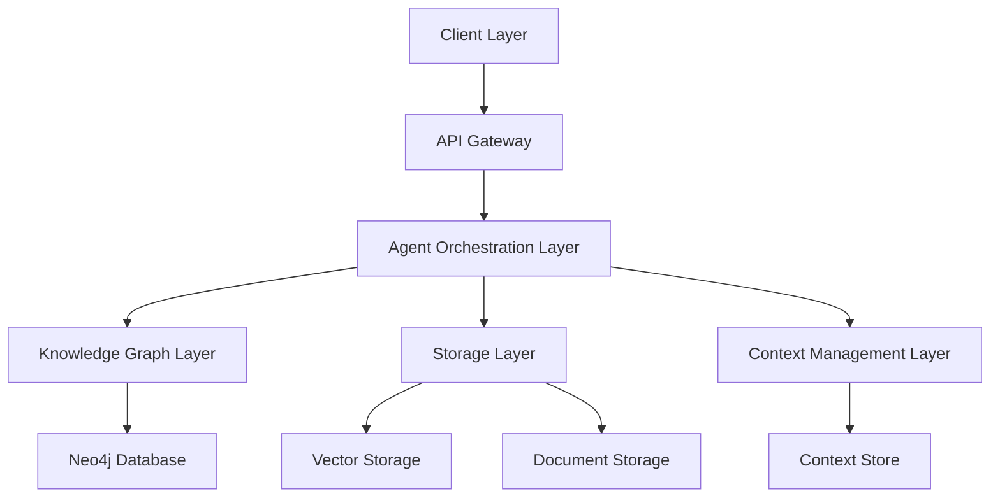
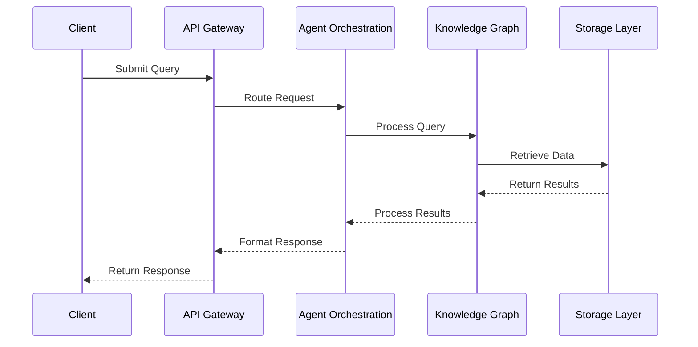
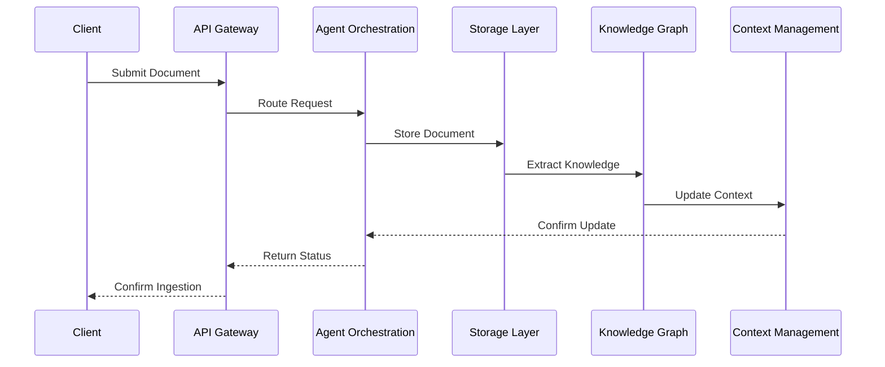

# Architecture Design

## Overview
This document outlines the architecture design of our Knowledge Retrieval System, detailing the system components, their interactions, and the overall system structure.

## Version Information
- Version: 1.0.0
- Last Updated: 2024-04-23
- Status: Active Development

## System Architecture

### High-Level Architecture


### Core Components

1. **Client Layer**
   - Purpose: User interface and API clients
   - Components:
     - Web Interface
     - API Clients
     - Admin Console
   - Responsibilities:
     - User interaction
     - Request handling
     - Response formatting

2. **API Gateway**
   - Purpose: Request routing and authentication
   - Components:
     - Router
     - Authenticator
     - Rate Limiter
   - Responsibilities:
     - Request validation
     - Authentication
     - Load balancing

3. **Agent Orchestration Layer**
   - Purpose: Agent coordination and task management
   - Components:
     - Agent Manager
     - Task Scheduler
     - Tool Registry
   - Responsibilities:
     - Agent lifecycle management
     - Task distribution
     - Tool coordination

4. **Knowledge Graph Layer**
   - Purpose: Knowledge representation and querying
   - Components:
     - Graph Manager
     - Query Engine
     - Index Manager
   - Responsibilities:
     - Graph operations
     - Query processing
     - Index maintenance

5. **Storage Layer**
   - Purpose: Data persistence and retrieval
   - Components:
     - Vector Store
     - Document Store
     - Cache Manager
   - Responsibilities:
     - Data storage
     - Data retrieval
     - Caching

6. **Context Management Layer**
   - Purpose: Context tracking and management
   - Components:
     - Context Store
     - Session Manager
     - Version Controller
   - Responsibilities:
     - Context persistence
     - Session handling
     - Version management

## Component Interactions

### 1. Query Processing Flow


### 2. Data Ingestion Flow


## Data Flow

### 1. Knowledge Representation
```python
class KnowledgeNode:
    """Represents a node in the knowledge graph"""
    id: str
    type: str
    properties: Dict[str, Any]
    embeddings: List[float]
    metadata: Dict[str, Any]

class KnowledgeRelationship:
    """Represents a relationship in the knowledge graph"""
    source_id: str
    target_id: str
    type: str
    properties: Dict[str, Any]
    confidence: float
```

### 2. Context Management
```python
class Context:
    """Manages context for operations"""
    session_id: str
    user_id: str
    context_data: Dict[str, Any]
    version: int
    timestamp: datetime
```

## Performance Requirements

### 1. Response Times
- API Gateway: < 100ms
- Knowledge Graph Queries: < 500ms
- Document Processing: < 2s
- Context Retrieval: < 200ms

### 2. Throughput
- API Requests: 1000 requests/second
- Document Ingestion: 100 documents/minute
- Graph Updates: 1000 nodes/second

### 3. Scalability
- Horizontal scaling for all components
- Load balancing at API Gateway
- Caching at multiple levels

## Security Architecture

### 1. Authentication
- JWT-based authentication
- API key management
- Role-based access control

### 2. Data Protection
- Encryption at rest
- Encryption in transit
- Secure key management

### 3. Access Control
- Fine-grained permissions
- Audit logging
- Session management

## Deployment Architecture

### 1. Development Environment
- Local development setup
- Docker containers
- Mock services

### 2. Staging Environment
- Cloud deployment
- Load testing
- Integration testing

### 3. Production Environment
- High availability setup
- Disaster recovery
- Monitoring and alerting

## Monitoring and Maintenance

### 1. Metrics Collection
- Performance metrics
- Error rates
- Resource usage

### 2. Logging
- Structured logging
- Log aggregation
- Alerting

### 3. Health Checks
- Component health
- System status
- Dependency status

## References
- [Architecture Decision Records](https://adr.github.io/)
- [Microservices Architecture](https://microservices.io/)
- [Cloud Native Architecture](https://www.cncf.io/) 