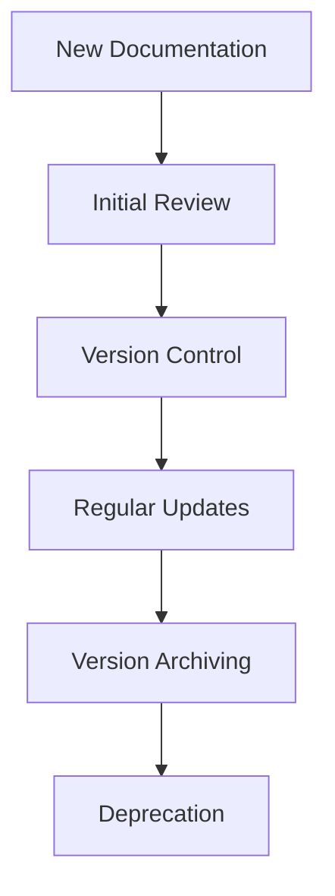

# Documentation Maintenance Plan

## Overview
This document outlines the maintenance procedures for our project documentation, including version control, changelog management, and review schedules.

## Version Information
- Version: 1.0.0
- Last Updated: 2024-04-28
- Status: Active

## Documentation Structure
```
memory_bank/
├── development/
│   ├── documentation/
│   │   ├── current/          # Current version of documentation
│   │   ├── versions/         # Archived versions
│   │   └── templates/        # Documentation templates
│   └── changelog/            # Documentation changelogs
└── templates/
    └── documentation/        # Template files
```

## Version Control Process

### 1. Document Lifecycle


### 2. Version Tagging
```bash
# Tag documentation version
git tag -a "docs/{component}-v{version}" -m "Documentation update for {component}"
```

## Changelog Management

### 1. Changelog Structure
```markdown
# Documentation Changelog

## [Unreleased]
### Added
- New documentation sections
- Additional examples
- New templates

### Changed
- Updated existing content
- Restructured sections
- Improved examples

### Fixed
- Typos and errors
- Broken links
- Inconsistent formatting

## [Version] - YYYY-MM-DD
### Added/Changed/Fixed
- List of changes
```

### 2. Changelog Maintenance
1. **Daily Updates**
   - Track minor changes in `[Unreleased]` section
   - Update changelog with each documentation change

2. **Version Releases**
   - Move `[Unreleased]` content to new version section
   - Update version number and date
   - Create new `[Unreleased]` section

## Maintenance Tools

### 1. Validation Tools
```python
class DocumentationValidator:
    """Validate documentation content and structure."""
    
    def check_links(self, file_path: str) -> List[str]:
        """Check for broken links."""
        pass
    
    def validate_code_examples(self, file_path: str) -> List[str]:
        """Validate code examples."""
        pass
    
    def check_version_numbers(self, file_path: str) -> bool:
        """Verify version numbers are consistent."""
        pass
```

### 2. Monitoring Dashboard
```python
class DocumentationDashboard:
    """Documentation status dashboard."""
    
    def __init__(self):
        self.validator = DocumentationValidator()
        self.metrics = DocumentationMetrics()
    
    def generate_report(self) -> Dict[str, Any]:
        """Generate documentation status report."""
        return {
            "last_updated": self.metrics.last_updated,
            "broken_links": self.metrics.broken_links,
            "validation_status": self.validator.get_status(),
            "review_status": self.get_review_status()
        }
```

## Maintenance Schedule

### 1. Regular Reviews
- **Daily**: Quick checks for broken links and recent changes
- **Weekly**: Validation checks and metrics updates
- **Monthly**: Comprehensive content review and template updates
- **Quarterly**: Major version updates and process optimization

### 2. Review Process
1. **Preparation**
   - Gather documentation metrics
   - Review changelog entries
   - Check validation reports

2. **Execution**
   - Apply quality standards
   - Update version information
   - Verify cross-references

3. **Follow-up**
   - Update changelog
   - Archive old versions
   - Update metrics

## Metrics and Reporting

### 1. Key Metrics
- Documentation coverage
- Update frequency
- Error rate
- Review completion

### 2. Reporting
- Weekly status reports
- Monthly review summaries
- Quarterly improvement plans

## References
- [Documentation Quality Standards](documentation_quality_standards.md)
- [Documentation Standards](documentation_standards.md)
- [Coding Standards](coding_standards.md) 