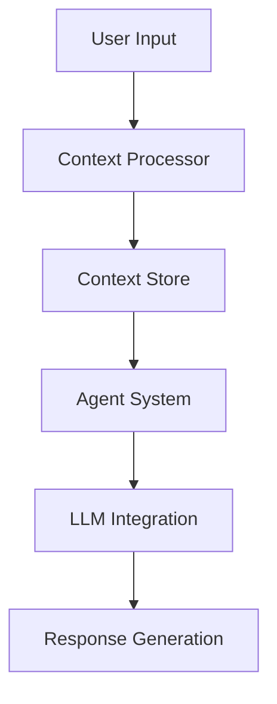

# Documentation Standards

## Overview

This document outlines the documentation standards for our Knowledge Retrieval Agentic System. These standards ensure consistent, clear, and maintainable documentation across all project components, with special consideration for LLM-based applications and Python development best practices.

## Documentation Types

### 1. Code Documentation

#### Python Docstrings
```python
def process_context(context: ContextNode, agent: Agent) -> Dict[str, Any]:
    """Process context data for agent consumption.
    
    This function takes a context node and processes it for use by an agent,
    including embedding generation and metadata enrichment.
    
    Args:
        context (ContextNode): The context node to process
        agent (Agent): The agent that will consume the processed context
        
    Returns:
        Dict[str, Any]: Processed context data including:
            - embeddings: List[float]
            - metadata: Dict[str, Any]
            - processed_content: Dict[str, Any]
            
    Raises:
        ContextProcessingError: If context processing fails
        AgentNotReadyError: If agent is not ready to process context
        
    Example:
        >>> context = ContextNode(id="123", type="text", content={"text": "Hello"})
        >>> agent = Agent(name="test_agent")
        >>> result = process_context(context, agent)
        >>> print(result["embeddings"])
        [0.1, 0.2, 0.3]
    """
    # Implementation here
```

#### LLM-Specific Documentation
```python
class LLMContextProcessor:
    """Processes and manages context for LLM interactions.
    
    This class handles the preparation and management of context for LLM-based
    agents, including token management, context window optimization, and
    prompt engineering.
    
    Attributes:
        model_name (str): Name of the LLM model being used
        max_tokens (int): Maximum token limit for the model
        context_window (int): Size of the context window
        
    Methods:
        prepare_context: Prepares context for LLM consumption
        optimize_tokens: Optimizes token usage
        manage_prompt: Handles prompt engineering
    """
```

### 2. API Documentation

#### REST API Endpoints
```markdown
## POST /api/v1/context/process

Processes context data for agent consumption.

### Request
```json
{
    "context_id": "string",
    "agent_id": "string",
    "options": {
        "include_embeddings": true,
        "include_metadata": true
    }
}
```

### Response
```json
{
    "status": "success",
    "data": {
        "processed_context": {
            "id": "string",
            "embeddings": [0.1, 0.2, 0.3],
            "metadata": {}
        }
    }
}
```

### Error Responses
- 400: Invalid request
- 404: Context not found
- 500: Processing error
```

#### LLM API Integration
```markdown
## Mistral API Integration

### Configuration
```python
MISTRAL_CONFIG = {
    "model": "mistral-large",
    "temperature": 0.7,
    "max_tokens": 4096,
    "context_window": 32000
}
```

### Usage
```python
from mistral import MistralClient

client = MistralClient(config=MISTRAL_CONFIG)
response = client.generate(
    prompt="Process the following context:",
    context=context_data
)
```
```

### 3. Architecture Documentation

#### System Components
```markdown
## Context Management System

### Overview
The Context Management System handles the persistence, sharing, and versioning
of context across our multi-agent environment.

### Components
1. Context Store
   - Neo4j-based storage
   - Vector index for semantic search
   - Version control system

2. Session Management
   - User session tracking
   - Context persistence
   - Access control

3. Context Sharing
   - Event-based communication
   - Real-time updates
   - Conflict resolution
```

#### Data Flow


### 4. User Documentation

#### Agent Usage
```markdown
## Using the Knowledge Retrieval Agent

### Basic Usage
```python
from agents import KnowledgeRetrievalAgent

agent = KnowledgeRetrievalAgent()
response = agent.query("What is the capital of France?")
```

### Advanced Features
- Context management
- Multi-agent collaboration
- Custom tool integration
```

#### Configuration Guide
```markdown
## System Configuration

### Environment Variables
```bash
export MISTRAL_API_KEY=your_api_key
export NEO4J_URI=bolt://localhost:7687
export NEO4J_USER=neo4j
export NEO4J_PASSWORD=password
```

### Configuration Files
```yaml
system:
  agents:
    max_concurrent: 10
    timeout: 30
  context:
    max_size: 1000
    retention_days: 30
```
```

## Documentation Best Practices

### 1. Code Documentation
- Use Google-style docstrings for Python code
- Include type hints for all function parameters and return values
- Document exceptions and error conditions
- Provide usage examples for complex functions
- Keep docstrings up-to-date with code changes

### 2. API Documentation
- Document all endpoints with request/response examples
- Include error codes and handling
- Provide authentication requirements
- Document rate limits and quotas
- Include versioning information

### 3. Architecture Documentation
- Use diagrams for system components and data flow
- Document design decisions and trade-offs
- Include scalability considerations
- Document integration points
- Provide deployment architecture

### 4. User Documentation
- Include quick-start guides
- Provide detailed configuration instructions
- Document common use cases
- Include troubleshooting guides
- Keep examples up-to-date

### 5. LLM-Specific Documentation
- Document prompt engineering strategies
- Include context window management
- Document token usage optimization
- Provide model-specific configurations
- Include error handling patterns

## Documentation Maintenance

### 1. Version Control
- Keep documentation in version control
- Link documentation to code versions
- Maintain changelog for documentation
- Review documentation with code reviews

### 2. Regular Updates
- Update documentation with code changes
- Review documentation quarterly
- Remove outdated information
- Add new features documentation

### 3. Quality Assurance
- Review documentation for clarity
- Test code examples
- Verify configuration examples
- Check for broken links
- Ensure consistency across documents

## Tools and Automation

### 1. Documentation Generation
- Use Sphinx for Python documentation
- Automate API documentation with OpenAPI
- Generate architecture diagrams with Mermaid
- Use MkDocs for project documentation

### 2. Documentation Testing
- Test code examples
- Verify configuration examples
- Check documentation links
- Validate API examples

### 3. Documentation Deployment
- Automate documentation builds
- Deploy documentation with code
- Maintain documentation versions
- Provide search functionality

## References

- [Google Python Style Guide](https://google.github.io/styleguide/pyguide.html)
- [Sphinx Documentation](https://www.sphinx-doc.org/)
- [OpenAPI Specification](https://swagger.io/specification/)
- [MkDocs Documentation](https://www.mkdocs.org/)

## Documentation Templates

### Template Location
All documentation templates are stored in the `memory_bank/templates/documentation/` directory. Each template is available in both Markdown and Python formats.

### 1. Agent Implementation Template
```markdown
# {Agent Name} Implementation

## Overview
Brief description of the agent's purpose and functionality.

## Core Capabilities
- List of main capabilities
- Key features
- Integration points

## Implementation Details

### Configuration
```python
class {AgentName}Config(BaseModel):
    """Configuration for {Agent Name} agent."""
    name: str
    model: str = "mistral-large"
    temperature: float = 0.7
    max_tokens: int = 4096
    context_window: int = 32000
```

### State Management
```python
class {AgentName}State(BaseModel):
    """State management for {Agent Name} agent."""
    current_context: Optional[ContextNode]
    conversation_history: List[Dict[str, Any]]
    tools_used: List[str]
    last_updated: datetime
```

### Tool Integration
```python
class {AgentName}Tools:
    """Tools available to {Agent Name} agent."""
    
    @tool
    async def process_context(self, context: ContextNode) -> Dict[str, Any]:
        """Process context for agent consumption."""
        pass
```

## Usage Examples
```python
# Basic usage example
agent = {AgentName}(config={AgentName}Config(name="example"))
response = await agent.process("input text")
```

## Error Handling
- List of common errors
- Error recovery strategies
- Retry mechanisms

## Performance Considerations
- Token usage optimization
- Context window management
- Caching strategies
```

### 2. Context Management Template
```markdown
# {Component Name} Context Management

## Overview
Description of context management component.

## Data Models
```python
class {ComponentName}Context(BaseModel):
    """Context model for {Component Name}."""
    id: str
    type: str
    content: Dict[str, Any]
    embeddings: List[float]
    metadata: Dict[str, Any]
    created_at: datetime
    updated_at: datetime
    version: int
```

## Storage Implementation
```python
class {ComponentName}Store:
    """Storage implementation for {Component Name}."""
    
    async def store_context(self, context: {ComponentName}Context):
        """Store context data."""
        pass
    
    async def retrieve_context(self, context_id: str) -> Optional[{ComponentName}Context]:
        """Retrieve context data."""
        pass
```

## Integration Points
- List of components that interact with this context
- Data flow diagrams
- API endpoints

## Version Control
- Versioning strategy
- Migration procedures
- Backward compatibility
```

### 3. API Endpoint Template
```markdown
# {API Name} API Documentation

## Endpoint: {HTTP Method} {Endpoint Path}

### Description
Brief description of the endpoint's purpose.

### Authentication
- Required: Yes/No
- Type: Bearer Token/API Key
- Scopes: List of required scopes

### Request
```json
{
    "field1": "type",
    "field2": "type"
}
```

### Response
```json
{
    "status": "success",
    "data": {
        // Response data structure
    }
}
```

### Error Responses
| Status Code | Description |
|-------------|-------------|
| 400 | Bad Request |
| 401 | Unauthorized |
| 404 | Not Found |
| 500 | Internal Server Error |

### Rate Limits
- Requests per minute: X
- Burst capacity: Y

### Example Usage
```python
# Python example
response = await client.{endpoint_name}(params)
```

### Testing
```python
# Test example
async def test_{endpoint_name}():
    # Test implementation
    pass
```
```

### 4. Knowledge Graph Node Template
```markdown
# {Node Type} Node Documentation

## Overview
Description of the node type and its purpose in the knowledge graph.

## Schema
```python
class {NodeType}Node(BaseModel):
    """Schema for {Node Type} nodes."""
    id: str
    type: str = "{node_type}"
    properties: Dict[str, Any]
    embeddings: List[float]
    metadata: Dict[str, Any]
    created_at: datetime
    updated_at: datetime
```

## Relationships
| Relationship Type | Target Node | Description |
|------------------|-------------|-------------|
| RELATES_TO | NodeType | Description |
| CONTAINS | NodeType | Description |

## Query Patterns
```cypher
// Common query patterns
MATCH (n:{NodeType})
WHERE n.property = value
RETURN n
```

## Indexes
- List of indexes
- Index types
- Query optimization

## Usage Examples
```python
# Create node
node = {NodeType}Node(
    id="unique_id",
    properties={},
    embeddings=[]
)

# Query nodes
results = await graph.query(
    "MATCH (n:{NodeType}) RETURN n"
)
```
```

### 5. Tool Implementation Template
```markdown
# {Tool Name} Tool Documentation

## Overview
Description of the tool's purpose and functionality.

## Implementation
```python
class {ToolName}Tool(Tool):
    """{Tool Name} tool implementation."""
    
    name: str = "{tool_name}"
    description: str = "Tool description"
    
    class Input(BaseModel):
        """Input model for {Tool Name}."""
        param1: str
        param2: Optional[int]
    
    class Output(BaseModel):
        """Output model for {Tool Name}."""
        result: Dict[str, Any]
        status: str
    
    async def execute(self, input: Input) -> Output:
        """Execute the tool."""
        pass
```

## Usage Examples
```python
# Basic usage
tool = {ToolName}Tool()
result = await tool.execute(
    {ToolName}Tool.Input(
        param1="value",
        param2=123
    )
)
```

## Error Handling
- List of possible errors
- Error recovery strategies
- Retry mechanisms

## Performance Considerations
- Resource usage
- Caching strategies
- Optimization techniques
```

## Using the Templates

### 1. Template Selection
Choose the appropriate template based on the component type:
- Agent Implementation Template: For new agent implementations
- Context Management Template: For context-related components
- API Endpoint Template: For REST API endpoints
- Knowledge Graph Node Template: For knowledge graph nodes
- Tool Implementation Template: For agent tools

### 2. Template Customization
1. Copy the template from the templates directory
2. Replace placeholders (text in {curly braces}) with actual values
3. Add or remove sections as needed
4. Update examples with real implementation details

### 3. Template Maintenance
- Keep templates up-to-date with project standards
- Review templates quarterly
- Update templates when new patterns emerge
- Document template changes in the changelog

### 4. Template Validation
Before using a template:
1. Verify all required sections are present
2. Check that examples are current
3. Ensure formatting is consistent
4. Validate against project standards 