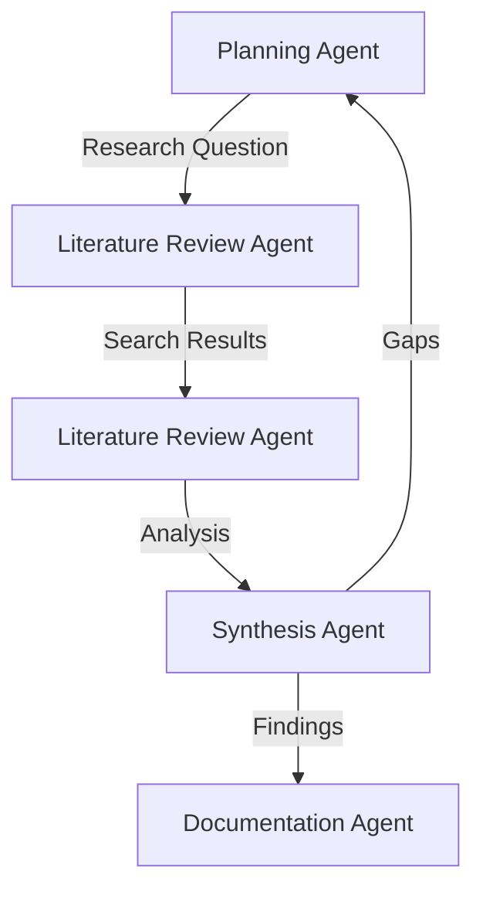
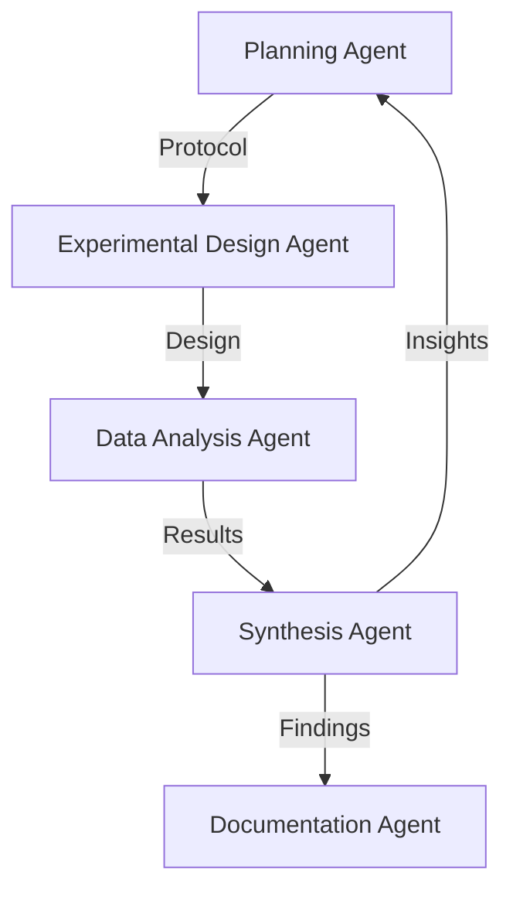
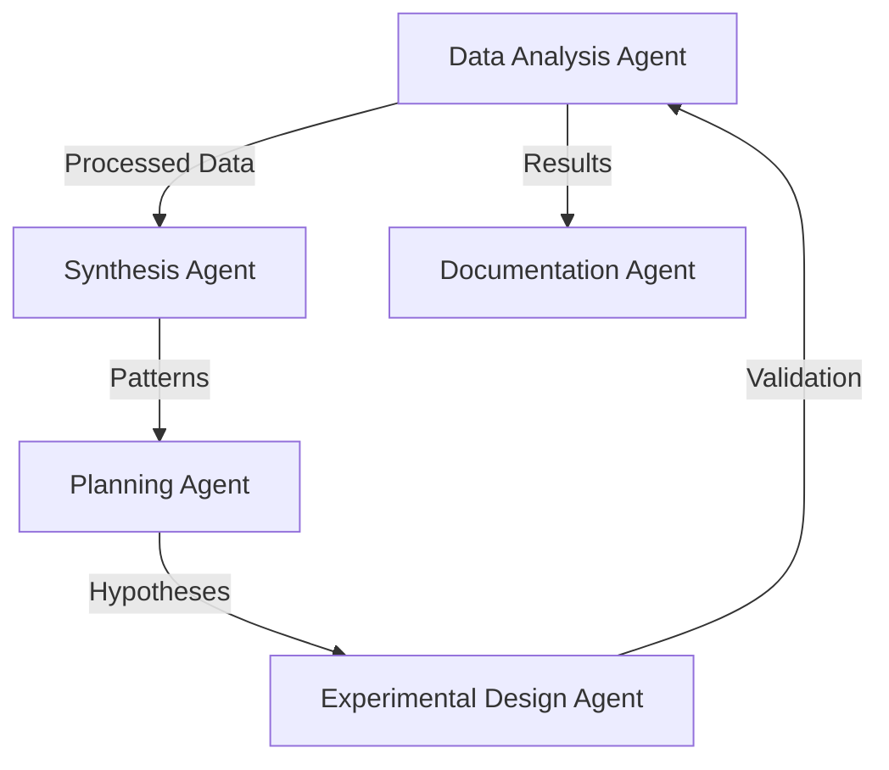

# Research Agent Architecture

## Overview
This document outlines the detailed architecture, roles, workflows, and communication patterns for our Research Assistant's multi-agent system. The architecture is designed to support complex research tasks while maintaining flexibility and scalability.

## Agent Roles and Responsibilities

### 1. Planning Agent
**Primary Responsibilities:**
- Research question formulation
- Methodology selection
- Gap analysis
- Strategy generation
- Resource allocation

**Key Capabilities:**
- Literature synthesis
- Research methodology expertise
- Strategic planning
- Resource optimization

**Communication Channels:**
- Direct communication with all other agents
- Research context updates
- Strategy adjustments
- Resource allocation requests

### 2. Literature Review Agent
**Primary Responsibilities:**
- Scientific literature search
- Paper analysis and extraction
- Citation tracking
- Research landscape mapping
- Knowledge gap identification

**Key Capabilities:**
- Semantic search
- Document analysis
- Citation management
- Trend analysis
- Knowledge synthesis

**Communication Channels:**
- Literature updates to Planning Agent
- Citation data to Documentation Agent
- Research gaps to Synthesis Agent
- Search results to all agents

### 3. Experimental Design Agent
**Primary Responsibilities:**
- Protocol development
- Parameter optimization
- Control condition design
- Methodology validation
- Reproducibility assurance

**Key Capabilities:**
- Experimental design
- Statistical analysis
- Protocol validation
- Resource optimization
- Error handling

**Communication Channels:**
- Protocol proposals to Planning Agent
- Experimental data to Data Analysis Agent
- Validation results to Synthesis Agent
- Resource requests to Planning Agent

### 4. Data Analysis Agent
**Primary Responsibilities:**
- Data processing
- Statistical analysis
- Pattern recognition
- Visualization generation
- Result validation

**Key Capabilities:**
- Statistical modeling
- Data visualization
- Pattern recognition
- Result validation
- Error detection

**Communication Channels:**
- Analysis results to Synthesis Agent
- Visualization requests to Documentation Agent
- Data quality alerts to Experimental Design Agent
- Statistical insights to Planning Agent

### 5. Synthesis Agent
**Primary Responsibilities:**
- Finding integration
- Connection identification
- Hypothesis generation
- Conclusion formation
- Validation support

**Key Capabilities:**
- Knowledge integration
- Pattern recognition
- Hypothesis generation
- Validation support
- Conclusion synthesis

**Communication Channels:**
- Synthesis reports to Documentation Agent
- Hypothesis proposals to Planning Agent
- Validation requests to Data Analysis Agent
- Knowledge updates to all agents

### 6. Documentation Agent
**Primary Responsibilities:**
- Research paper generation
- Methodology documentation
- Result presentation
- Citation management
- Format compliance

**Key Capabilities:**
- Document generation
- Citation management
- Format compliance
- Quality assurance
- Version control

**Communication Channels:**
- Document drafts to all agents
- Citation requests to Literature Review Agent
- Format compliance checks to Planning Agent
- Version updates to all agents

## Workflow Scenarios

### 1. Literature Review Workflow


### 2. Experimental Workflow


### 3. Analysis Workflow


## Communication Patterns

### 1. Direct Communication
- Agent-to-agent messaging
- Real-time updates
- Status notifications
- Resource requests

### 2. Broadcast Communication
- Research context updates
- System-wide notifications
- Status broadcasts
- Resource availability

### 3. State Management
- Shared research context
- Progress tracking
- Resource allocation
- Knowledge base updates

## Integration Points

### 1. External Systems
- Citation management (Zotero)
- Document processing
- Data analysis tools
- Visualization systems

### 2. Internal Systems
- Knowledge base
- State management
- Resource allocation
- Workflow orchestration

## Agent Interaction Models

### 1. Team Meetings
- **Purpose**: Collaborative research planning and progress review
- **Participants**: All agents + human researcher
- **Structure**:
  ```python
  class TeamMeeting:
      def __init__(self, agents, human_researcher):
          self.agents = agents
          self.human = human_researcher
          self.agenda = []
          self.minutes = []
          
      def run_meeting(self):
          # 1. Agenda setting
          # 2. Progress review
          # 3. Problem discussion
          # 4. Action planning
          # 5. Minutes generation
  ```

### 2. Individual Meetings
- **Purpose**: Focused task execution and problem-solving
- **Participants**: Single agent + human researcher
- **Structure**:
  ```python
  class IndividualMeeting:
      def __init__(self, agent, human_researcher):
          self.agent = agent
          self.human = human_researcher
          self.task = None
          self.progress = []
          
      def execute_task(self):
          # 1. Task clarification
          # 2. Execution planning
          # 3. Progress updates
          # 4. Result review
  ```

## Agent Implementation Details

### 1. Base Agent Class
```python
class ResearchAgent:
    def __init__(self, role, capabilities, knowledge_base):
        self.role = role
        self.capabilities = capabilities
        self.knowledge_base = knowledge_base
        self.state = {}
        
    def process_message(self, message):
        # Message handling logic
        pass
        
    def update_state(self, new_state):
        # State management
        pass
        
    def execute_task(self, task):
        # Task execution logic
        pass
```

### 2. Agent Communication
```python
class AgentCommunication:
    def __init__(self, agents):
        self.agents = agents
        self.message_queue = []
        
    def send_message(self, sender, receiver, message):
        # Message routing
        pass
        
    def broadcast(self, sender, message):
        # System-wide communication
        pass
```

### 3. State Management
```python
class ResearchState:
    def __init__(self):
        self.context = {}
        self.progress = {}
        self.resources = {}
        
    def update_context(self, new_context):
        # Context management
        pass
        
    def track_progress(self, agent, progress):
        # Progress tracking
        pass
```

## Integration with Human Researcher

### 1. Interface Components
- Research dashboard
- Progress visualization
- Task management
- Communication interface

### 2. Collaboration Patterns
- Real-time feedback
- Task delegation
- Progress review
- Knowledge sharing

### 3. Control Mechanisms
- Task prioritization
- Resource allocation
- Workflow adjustment
- Quality control

## Implementation Guidelines

### 1. Agent Development
- Role-based specialization
- Clear interfaces
- State management
- Error handling
- Human interaction support

### 2. Communication Implementation
- Message queues
- Event handling
- State synchronization
- Error recovery
- Human feedback integration

### 3. Workflow Management
- State tracking
- Progress monitoring
- Resource allocation
- Error handling
- Human oversight

## Version Information
- Version: 1.0.0
- Last Updated: 2024-04-23
- Status: Active Development

## References
- [The AI Scientist: Towards Fully Automated Open-Ended Scientific Discovery](https://sakana.ai/ai-scientist/)
- [Multi-Agent Research Systems](https://arxiv.org/pdf/2408.06292)
- [CrewAI Documentation](https://docs.crewai.com/)
- [Virtual Lab Implementation](https://github.com/zou-group/virtual-lab)

## Multi-LLM Architecture

### 1. LLM Configuration per Agent
```python
class LLMConfig:
    def __init__(self, provider, model, api_key, rate_limit, cost_per_token):
        self.provider = provider  # e.g., 'openai', 'anthropic', 'google'
        self.model = model        # e.g., 'gpt-4', 'claude-3', 'gemini-pro'
        self.api_key = api_key
        self.rate_limit = rate_limit
        self.cost_per_token = cost_per_token

class AgentLLMConfig:
    def __init__(self):
        self.planning_agent = LLMConfig(
            provider='anthropic',
            model='claude-3-opus',
            api_key='ANTHROPIC_API_KEY',
            rate_limit=100,
            cost_per_token=0.00002
        )
        
        self.literature_agent = LLMConfig(
            provider='openai',
            model='gpt-4-turbo',
            api_key='OPENAI_API_KEY_1',
            rate_limit=200,
            cost_per_token=0.00001
        )
        
        self.experimental_agent = LLMConfig(
            provider='google',
            model='gemini-pro',
            api_key='GOOGLE_API_KEY',
            rate_limit=150,
            cost_per_token=0.000015
        )
        
        self.analysis_agent = LLMConfig(
            provider='openai',
            model='gpt-4-turbo',
            api_key='OPENAI_API_KEY_2',
            rate_limit=200,
            cost_per_token=0.00001
        )
        
        self.synthesis_agent = LLMConfig(
            provider='anthropic',
            model='claude-3-sonnet',
            api_key='ANTHROPIC_API_KEY_2',
            rate_limit=100,
            cost_per_token=0.000015
        )
        
        self.documentation_agent = LLMConfig(
            provider='openai',
            model='gpt-4-turbo',
            api_key='OPENAI_API_KEY_3',
            rate_limit=200,
            cost_per_token=0.00001
        )
```

### 2. LLM Selection Strategy

#### A. Specialization-based Selection
- **Planning Agent**: Claude-3 (strong reasoning, strategic planning)
- **Literature Agent**: GPT-4 (excellent text understanding, citation handling)
- **Experimental Agent**: Gemini (strong in technical domains)
- **Analysis Agent**: GPT-4 (strong in data analysis, pattern recognition)
- **Synthesis Agent**: Claude-3 (excellent at integration, hypothesis generation)
- **Documentation Agent**: GPT-4 (strong in writing, formatting)

#### B. Cost Optimization
- Use cheaper models for simpler tasks
- Reserve expensive models for complex reasoning
- Implement token usage tracking
- Set budget limits per agent

#### C. Rate Limit Management
- Distribute requests across different providers
- Implement request queuing
- Use multiple API keys per provider
- Monitor and adjust usage patterns

### 3. Anti-bias Design

#### A. Model Diversity
- Use different model families
- Mix proprietary and open-source models
- Vary model sizes and architectures
- Implement ensemble approaches

#### B. Response Validation
```python
class ResponseValidator:
    def __init__(self, agents):
        self.agents = agents
        
    def validate_response(self, response, context):
        # Cross-validate with other agents
        validations = []
        for agent in self.agents:
            if agent != response.agent:
                validation = agent.validate(response, context)
                validations.append(validation)
        return self.aggregate_validations(validations)
```

#### C. Consensus Building
```python
class ConsensusBuilder:
    def __init__(self, agents):
        self.agents = agents
        
    def build_consensus(self, question):
        responses = []
        for agent in self.agents:
            response = agent.answer(question)
            responses.append(response)
        return self.find_consensus(responses)
```

### 4. Implementation Guidelines

#### A. LLM Integration
- Abstract LLM interface
- Provider-specific adapters
- Fallback mechanisms
- Error handling

#### B. Cost Management
- Token usage tracking
- Budget allocation
- Cost optimization
- Usage reporting

#### C. Rate Limit Handling
- Request queuing
- Load balancing
- Retry mechanisms
- Circuit breakers

#### D. Anti-bias Measures
- Response validation
- Consensus building
- Diversity enforcement
- Bias detection

### 5. Monitoring and Optimization

#### A. Performance Metrics
- Response time
- Token usage
- Cost per task
- Success rate

#### B. Quality Metrics
- Response accuracy
- Bias detection
- Consensus strength
- Validation success

#### C. Optimization Strategies
- Model selection
- Prompt engineering
- Cost optimization
- Rate limit management

## Request Analysis and Intelligent Routing

### 1. Request Classification System
```python
class RequestClassifier:
    def __init__(self):
        self.simple_queries = {
            'greetings': ['hello', 'hi', 'hey', 'how are you'],
            'basic_info': ['what is', 'who is', 'when is'],
            'trivial': ['thanks', 'thank you', 'bye']
        }
        
    def classify_request(self, request):
        # Analyze request complexity
        complexity_score = self._calculate_complexity(request)
        
        # Check for simple queries
        if self._is_simple_query(request):
            return 'simple', complexity_score
            
        # Check for research queries
        if self._is_research_query(request):
            return 'research', complexity_score
            
        # Default to general processing
        return 'general', complexity_score
        
    def _calculate_complexity(self, request):
        # Implement complexity scoring
        pass
        
    def _is_simple_query(self, request):
        # Check against simple queries database
        pass
        
    def _is_research_query(self, request):
        # Check for research indicators
        pass
```

### 2. Routing Guardrails

#### A. Complexity Thresholds
```python
class RoutingGuardrails:
    def __init__(self):
        self.thresholds = {
            'simple': 0.3,
            'general': 0.6,
            'research': 0.8
        }
        
    def should_route_to_llm(self, request_type, complexity_score):
        return complexity_score >= self.thresholds[request_type]
        
    def get_appropriate_agent(self, request_type, complexity_score):
        if request_type == 'simple':
            return 'general_agent'
        elif request_type == 'research':
            if complexity_score > 0.9:
                return 'expert_agent'
            else:
                return 'research_agent'
        else:
            return 'general_agent'
```

#### B. Security Requirements
```python
class SecurityGuardrails:
    def __init__(self):
        self.industry_standards = {
            'data_privacy': ['GDPR', 'CCPA', 'HIPAA'],
            'security': ['ISO 27001', 'SOC 2', 'NIST'],
            'compliance': ['FERPA', 'COPPA']
        }
        
    def validate_request(self, request):
        # Check for sensitive information
        if self._contains_sensitive_data(request):
            return False, 'Sensitive data detected'
            
        # Check for compliance requirements
        if not self._meets_compliance(request):
            return False, 'Compliance requirements not met'
            
        return True, 'Request validated'
        
    def _contains_sensitive_data(self, request):
        # Implement sensitive data detection
        pass
        
    def _meets_compliance(self, request):
        # Check against compliance standards
        pass
```

### 3. Expert Selection System
```python
class ExpertSelector:
    def __init__(self, agents):
        self.agents = agents
        self.expertise_map = self._build_expertise_map()
        
    def select_expert(self, request):
        # Analyze request requirements
        requirements = self._analyze_requirements(request)
        
        # Match with agent expertise
        best_match = self._find_best_match(requirements)
        
        return best_match
        
    def _build_expertise_map(self):
        # Map agents to their expertise areas
        pass
        
    def _analyze_requirements(self, request):
        # Extract expertise requirements
        pass
        
    def _find_best_match(self, requirements):
        # Find best matching agent
        pass
```

### 4. Implementation Guidelines

#### A. Request Processing Pipeline
1. **Initial Analysis**
   - Request classification
   - Complexity scoring
   - Security validation

2. **Routing Decision**
   - Threshold checking
   - Expert selection
   - Resource allocation

3. **Execution**
   - Task delegation
   - Progress monitoring
   - Result validation

#### B. Security Measures
- Data encryption
- Access control
- Audit logging
- Compliance monitoring

#### C. Performance Optimization
- Request caching
- Load balancing
- Resource allocation
- Response optimization

### 5. Monitoring and Metrics

#### A. Performance Metrics
- Request processing time
- Classification accuracy
- Routing efficiency
- Resource utilization

#### B. Security Metrics
- Compliance violations
- Security incidents
- Data breaches
- Access attempts

#### C. Quality Metrics
- Response accuracy
- User satisfaction
- Error rates
- Resolution time

## Memory Architecture

### 1. Memory Types and Organization

#### A. Short-term Memory (Working Memory)
```python
class WorkingMemory:
    def __init__(self, max_tokens=4000):
        self.max_tokens = max_tokens
        self.conversation_history = []
        self.current_context = {}
        self.temporary_data = {}
        
    def add_to_history(self, message):
        # Add message to history
        self.conversation_history.append(message)
        self._maintain_token_limit()
        
    def update_context(self, key, value):
        # Update current context
        self.current_context[key] = value
        
    def _maintain_token_limit(self):
        # Implement token management
        pass
```

#### B. Long-term Memory
```python
class LongTermMemory:
    def __init__(self):
        self.semantic_memory = VectorStore()  # For factual knowledge
        self.procedural_memory = {}  # For task procedures
        self.episodic_memory = TimeSeriesStore()  # For past experiences
        
    def store_semantic(self, knowledge):
        # Store factual information
        pass
        
    def store_procedural(self, task_id, procedure):
        # Store task procedures
        pass
        
    def store_episodic(self, experience):
        # Store past experiences
        pass
```

### 2. Memory Management System

#### A. Memory Hierarchy
```python
class MemoryManager:
    def __init__(self):
        self.working_memory = WorkingMemory()
        self.long_term_memory = LongTermMemory()
        self.shared_memory = SharedMemory()
        
    def process_memory(self, data):
        # Determine memory type and storage location
        if self._is_ephemeral(data):
            self.working_memory.store(data)
        elif self._is_knowledge(data):
            self.long_term_memory.store_semantic(data)
        elif self._is_experience(data):
            self.long_term_memory.store_episodic(data)
            
    def retrieve_memory(self, query):
        # Implement retrieval strategy
        pass
```

#### B. Shared Memory Implementation
```python
class SharedMemory:
    def __init__(self):
        self.agent_states = {}
        self.research_context = {}
        self.collaborative_data = {}
        
    def update_agent_state(self, agent_id, state):
        # Update agent-specific state
        pass
        
    def update_research_context(self, context):
        # Update shared research context
        pass
        
    def share_data(self, data, agents):
        # Share data between agents
        pass
```

### 3. Memory Optimization

#### A. Token Management
```python
class TokenManager:
    def __init__(self):
        self.token_budgets = {
            'working_memory': 4000,
            'context_window': 8000,
            'retrieval': 2000
        }
        
    def optimize_memory_usage(self, memory_type, content):
        # Implement token optimization
        pass
        
    def compress_memory(self, memory):
        # Implement memory compression
        pass
```

#### B. Retrieval Optimization
```python
class MemoryRetriever:
    def __init__(self):
        self.cache = {}
        self.retrieval_strategies = {
            'semantic': self._semantic_retrieval,
            'temporal': self._temporal_retrieval,
            'contextual': self._contextual_retrieval
        }
        
    def retrieve(self, query, strategy='semantic'):
        # Implement retrieval with strategy selection
        pass
```

### 4. Implementation Guidelines

#### A. Memory Storage
- Use vector databases for semantic memory
- Implement time-series storage for episodic memory
- Maintain procedural memory in structured format
- Use caching for frequently accessed data

#### B. Memory Access
- Implement efficient retrieval mechanisms
- Use context-aware access patterns
- Maintain access logs and audit trails
- Implement access control mechanisms

#### C. Memory Optimization
- Implement token budgeting
- Use compression techniques
- Maintain memory hierarchies
- Implement garbage collection

### 5. Monitoring and Metrics

#### A. Memory Usage Metrics
- Token utilization
- Storage efficiency
- Retrieval performance
- Cache hit rates

#### B. Performance Metrics
- Memory access latency
- Storage throughput
- Retrieval accuracy
- Compression ratios

#### C. Quality Metrics
- Memory relevance
- Context preservation
- Data consistency
- Retrieval accuracy

### 6. Integration with System Components

#### A. Storage Layer Integration
```python
class MemoryPersistence:
    """Handles memory persistence across storage layers"""
    def __init__(self, storage_layer: StorageLayer):
        self.storage = storage_layer
        
    async def persist_working_memory(self, memory: WorkingMemory):
        """Persist working memory state"""
        # Store in B2 for recovery
        await self.storage.b2_client.upload(
            f"memory/states/{memory.id}.json",
            memory.serialize()
        )
        
    async def persist_long_term_memory(self, memory: LongTermMemory):
        """Persist long-term memory state"""
        # Store semantic memory in Qdrant
        await self.storage.qdrant_client.upsert(
            "semantic_memory",
            memory.semantic_memory.vectors
        )
        # Store procedural memory in Meilisearch
        await self.storage.meilisearch_client.index(
            "procedural_memory"
        ).add_documents(memory.procedural_memory)
```

#### B. Knowledge Graph Integration
```python
class MemoryGraphBridge:
    """Bridges memory system with knowledge graph"""
    def __init__(self, graph_manager: GraphManager):
        self.graph = graph_manager
        
    async def sync_episodic_memory(self, memory: EpisodicMemory):
        """Sync episodic memory with knowledge graph"""
        # Create temporal relationships
        for event in memory.events:
            await self.graph.create_relationship(
                source_id=event.source,
                target_id=event.target,
                relationship_type=event.type,
                properties={
                    'timestamp': event.timestamp,
                    'confidence': event.confidence
                }
            )
            
    async def enhance_retrieval(self, query: str):
        """Enhance memory retrieval with graph context"""
        # Get graph context
        context = await self.graph.query_context(query)
        # Use context to improve memory retrieval
        return await self.memory_retriever.retrieve(
            query,
            context=context
        )
```

#### C. Context Management Integration
```python
class MemoryContextBridge:
    """Bridges memory system with context management"""
    def __init__(self, context_manager: ContextManager):
        self.context = context_manager
        
    async def sync_context(self, memory: WorkingMemory):
        """Sync working memory context with context management"""
        # Update context manager with working memory state
        await self.context.update_context(
            memory.id,
            {
                'conversation_history': memory.conversation_history,
                'current_context': memory.current_context
            }
        )
        
    async def merge_contexts(self, memory_id: str):
        """Merge contexts from different memory types"""
        # Get working memory context
        working_context = await self.context.get_context(memory_id)
        # Get long-term memory context
        long_term_context = await self.long_term_memory.get_context(memory_id)
        # Merge contexts
        return await self.context.merge(
            working_context,
            long_term_context
        )
```

### 7. Implementation Guidelines

#### A. Memory Persistence
- Implement regular backup of working memory states
- Use storage layer for memory persistence
- Maintain memory state versioning
- Implement recovery mechanisms

#### B. Knowledge Graph Integration
- Sync episodic memory with temporal aspects of graph
- Use graph context to enhance memory retrieval
- Maintain consistency between memory and graph
- Implement efficient query patterns

#### C. Context Management
- Keep working memory and context management in sync
- Implement efficient context merging
- Maintain context versioning
- Support context sharing between agents

## Hybrid Cloud Architecture

### 1. Cloud Services Integration

#### A. Vector Storage (Qdrant Cloud)
```python
class QdrantCloudIntegration:
    """Manages Qdrant Cloud integration"""
    def __init__(self, api_key: str, cloud_url: str):
        self.client = QdrantClient(
            url=cloud_url,
            api_key=api_key
        )
        
    async def store_vectors(self, collection: str, vectors: List[Vector]):
        """Store vectors in Qdrant Cloud"""
        await self.client.upsert(
            collection_name=collection,
            points=vectors
        )
        
    async def search_vectors(self, collection: str, query_vector: Vector):
        """Search vectors in Qdrant Cloud"""
        return await self.client.search(
            collection_name=collection,
            query_vector=query_vector
        )
```

#### B. Document Storage (Meilisearch Cloud)
```python
class MeilisearchCloudIntegration:
    """Manages Meilisearch Cloud integration"""
    def __init__(self, api_key: str, cloud_url: str):
        self.client = MeilisearchClient(
            url=cloud_url,
            api_key=api_key
        )
        
    async def index_documents(self, index: str, documents: List[Dict]):
        """Index documents in Meilisearch Cloud"""
        await self.client.index(index).add_documents(documents)
        
    async def search_documents(self, index: str, query: str):
        """Search documents in Meilisearch Cloud"""
        return await self.client.index(index).search(query)
```

#### C. Object Storage (Backblaze B2)
```python
class B2CloudIntegration:
    """Manages Backblaze B2 integration"""
    def __init__(self, key_id: str, application_key: str):
        self.client = B2Client(
            key_id=key_id,
            application_key=application_key
        )
        
    async def store_object(self, bucket: str, key: str, data: bytes):
        """Store object in B2 Cloud"""
        await self.client.upload_file(
            bucket_name=bucket,
            file_name=key,
            data=data
        )
        
    async def retrieve_object(self, bucket: str, key: str):
        """Retrieve object from B2 Cloud"""
        return await self.client.download_file(
            bucket_name=bucket,
            file_name=key
        )
```

### 2. Local Services

#### A. Agent Orchestration (LangGraph)
```python
class LocalAgentOrchestration:
    """Manages local agent orchestration"""
    def __init__(self):
        self.graph = StateGraph(AgentState)
        self.agents = {}
        
    def add_agent(self, agent: Agent):
        """Add agent to orchestration"""
        self.agents[agent.id] = agent
        self.graph.add_node(agent.id, agent)
        
    def add_edge(self, source: str, target: str):
        """Add edge between agents"""
        self.graph.add_edge(source, target)
```

#### B. Knowledge Graph (Neo4j)
```python
class LocalKnowledgeGraph:
    """Manages local Neo4j instance"""
    def __init__(self, uri: str, user: str, password: str):
        self.driver = GraphDatabase.driver(uri, auth=(user, password))
        
    async def execute_query(self, query: str, parameters: Dict = None):
        """Execute Cypher query"""
        with self.driver.session() as session:
            return session.run(query, parameters)
```

### 3. Implementation Guidelines

#### A. Cloud Services
- Use Qdrant Cloud for semantic memory storage
- Use Meilisearch Cloud for procedural memory storage
- Use B2 Cloud for episodic memory storage
- Monitor usage to stay within free tier limits
- Implement fallback mechanisms for service outages

#### B. Local Services
- Install LangGraph for agent orchestration
- Set up Neo4j for knowledge graph
- Implement custom memory management
- Use Docker for containerization
- Implement monitoring and logging

#### C. Integration Points
- Use API clients for cloud services
- Implement proper error handling
- Use async/await for non-blocking operations
- Implement retry mechanisms
- Use connection pooling

### 4. Monitoring and Metrics

#### A. Cloud Services
- API usage metrics
- Storage utilization
- Request latency
- Error rates
- Cost tracking

#### B. Local Services
- Resource utilization
- Query performance
- Memory usage
- Agent performance
- System health

## Version Information
- Version: 1.0.0
- Last Updated: 2024-04-23
- Status: Active Development

## References
- [The AI Scientist: Towards Fully Automated Open-Ended Scientific Discovery](https://sakana.ai/ai-scientist/)
- [Multi-Agent Research Systems](https://arxiv.org/pdf/2408.06292)
- [CrewAI Documentation](https://docs.crewai.com/)
- [Virtual Lab Implementation](https://github.com/zou-group/virtual-lab)

## Multi-LLM Architecture

### 1. LLM Configuration per Agent
```python
class LLMConfig:
    def __init__(self, provider, model, api_key, rate_limit, cost_per_token):
        self.provider = provider  # e.g., 'openai', 'anthropic', 'google'
        self.model = model        # e.g., 'gpt-4', 'claude-3', 'gemini-pro'
        self.api_key = api_key
        self.rate_limit = rate_limit
        self.cost_per_token = cost_per_token

class AgentLLMConfig:
    def __init__(self):
        self.planning_agent = LLMConfig(
            provider='anthropic',
            model='claude-3-opus',
            api_key='ANTHROPIC_API_KEY',
            rate_limit=100,
            cost_per_token=0.00002
        )
        
        self.literature_agent = LLMConfig(
            provider='openai',
            model='gpt-4-turbo',
            api_key='OPENAI_API_KEY_1',
            rate_limit=200,
            cost_per_token=0.00001
        )
        
        self.experimental_agent = LLMConfig(
            provider='google',
            model='gemini-pro',
            api_key='GOOGLE_API_KEY',
            rate_limit=150,
            cost_per_token=0.000015
        )
        
        self.analysis_agent = LLMConfig(
            provider='openai',
            model='gpt-4-turbo',
            api_key='OPENAI_API_KEY_2',
            rate_limit=200,
            cost_per_token=0.00001
        )
        
        self.synthesis_agent = LLMConfig(
            provider='anthropic',
            model='claude-3-sonnet',
            api_key='ANTHROPIC_API_KEY_2',
            rate_limit=100,
            cost_per_token=0.000015
        )
        
        self.documentation_agent = LLMConfig(
            provider='openai',
            model='gpt-4-turbo',
            api_key='OPENAI_API_KEY_3',
            rate_limit=200,
            cost_per_token=0.00001
        )
```

### 2. LLM Selection Strategy

#### A. Specialization-based Selection
- **Planning Agent**: Claude-3 (strong reasoning, strategic planning)
- **Literature Agent**: GPT-4 (excellent text understanding, citation handling)
- **Experimental Agent**: Gemini (strong in technical domains)
- **Analysis Agent**: GPT-4 (strong in data analysis, pattern recognition)
- **Synthesis Agent**: Claude-3 (excellent at integration, hypothesis generation)
- **Documentation Agent**: GPT-4 (strong in writing, formatting)

#### B. Cost Optimization
- Use cheaper models for simpler tasks
- Reserve expensive models for complex reasoning
- Implement token usage tracking
- Set budget limits per agent

#### C. Rate Limit Management
- Distribute requests across different providers
- Implement request queuing
- Use multiple API keys per provider
- Monitor and adjust usage patterns

### 3. Anti-bias Design

#### A. Model Diversity
- Use different model families
- Mix proprietary and open-source models
- Vary model sizes and architectures
- Implement ensemble approaches

#### B. Response Validation
```python
class ResponseValidator:
    def __init__(self, agents):
        self.agents = agents
        
    def validate_response(self, response, context):
        # Cross-validate with other agents
        validations = []
        for agent in self.agents:
            if agent != response.agent:
                validation = agent.validate(response, context)
                validations.append(validation)
        return self.aggregate_validations(validations)
```

#### C. Consensus Building
```python
class ConsensusBuilder:
    def __init__(self, agents):
        self.agents = agents
        
    def build_consensus(self, question):
        responses = []
        for agent in self.agents:
            response = agent.answer(question)
            responses.append(response)
        return self.find_consensus(responses)
```

### 4. Implementation Guidelines

#### A. LLM Integration
- Abstract LLM interface
- Provider-specific adapters
- Fallback mechanisms
- Error handling

#### B. Cost Management
- Token usage tracking
- Budget allocation
- Cost optimization
- Usage reporting

#### C. Rate Limit Handling
- Request queuing
- Load balancing
- Retry mechanisms
- Circuit breakers

#### D. Anti-bias Measures
- Response validation
- Consensus building
- Diversity enforcement
- Bias detection

### 5. Monitoring and Optimization

#### A. Performance Metrics
- Response time
- Token usage
- Cost per task
- Success rate

#### B. Quality Metrics
- Response accuracy
- Bias detection
- Consensus strength
- Validation success

#### C. Optimization Strategies
- Model selection
- Prompt engineering
- Cost optimization
- Rate limit management

## Request Analysis and Intelligent Routing

### 1. Request Classification System
```python
class RequestClassifier:
    def __init__(self):
        self.simple_queries = {
            'greetings': ['hello', 'hi', 'hey', 'how are you'],
            'basic_info': ['what is', 'who is', 'when is'],
            'trivial': ['thanks', 'thank you', 'bye']
        }
        
    def classify_request(self, request):
        # Analyze request complexity
        complexity_score = self._calculate_complexity(request)
        
        # Check for simple queries
        if self._is_simple_query(request):
            return 'simple', complexity_score
            
        # Check for research queries
        if self._is_research_query(request):
            return 'research', complexity_score
            
        # Default to general processing
        return 'general', complexity_score
        
    def _calculate_complexity(self, request):
        # Implement complexity scoring
        pass
        
    def _is_simple_query(self, request):
        # Check against simple queries database
        pass
        
    def _is_research_query(self, request):
        # Check for research indicators
        pass
```

### 2. Routing Guardrails

#### A. Complexity Thresholds
```python
class RoutingGuardrails:
    def __init__(self):
        self.thresholds = {
            'simple': 0.3,
            'general': 0.6,
            'research': 0.8
        }
        
    def should_route_to_llm(self, request_type, complexity_score):
        return complexity_score >= self.thresholds[request_type]
        
    def get_appropriate_agent(self, request_type, complexity_score):
        if request_type == 'simple':
            return 'general_agent'
        elif request_type == 'research':
            if complexity_score > 0.9:
                return 'expert_agent'
            else:
                return 'research_agent'
        else:
            return 'general_agent'
```

#### B. Security Requirements
```python
class SecurityGuardrails:
    def __init__(self):
        self.industry_standards = {
            'data_privacy': ['GDPR', 'CCPA', 'HIPAA'],
            'security': ['ISO 27001', 'SOC 2', 'NIST'],
            'compliance': ['FERPA', 'COPPA']
        }
        
    def validate_request(self, request):
        # Check for sensitive information
        if self._contains_sensitive_data(request):
            return False, 'Sensitive data detected'
            
        # Check for compliance requirements
        if not self._meets_compliance(request):
            return False, 'Compliance requirements not met'
            
        return True, 'Request validated'
        
    def _contains_sensitive_data(self, request):
        # Implement sensitive data detection
        pass
        
    def _meets_compliance(self, request):
        # Check against compliance standards
        pass
```

### 3. Expert Selection System
```python
class ExpertSelector:
    def __init__(self, agents):
        self.agents = agents
        self.expertise_map = self._build_expertise_map()
        
    def select_expert(self, request):
        # Analyze request requirements
        requirements = self._analyze_requirements(request)
        
        # Match with agent expertise
        best_match = self._find_best_match(requirements)
        
        return best_match
        
    def _build_expertise_map(self):
        # Map agents to their expertise areas
        pass
        
    def _analyze_requirements(self, request):
        # Extract expertise requirements
        pass
        
    def _find_best_match(self, requirements):
        # Find best matching agent
        pass
```

### 4. Implementation Guidelines

#### A. Request Processing Pipeline
1. **Initial Analysis**
   - Request classification
   - Complexity scoring
   - Security validation

2. **Routing Decision**
   - Threshold checking
   - Expert selection
   - Resource allocation

3. **Execution**
   - Task delegation
   - Progress monitoring
   - Result validation

#### B. Security Measures
- Data encryption
- Access control
- Audit logging
- Compliance monitoring

#### C. Performance Optimization
- Request caching
- Load balancing
- Resource allocation
- Response optimization

### 5. Monitoring and Metrics

#### A. Performance Metrics
- Request processing time
- Classification accuracy
- Routing efficiency
- Resource utilization

#### B. Security Metrics
- Compliance violations
- Security incidents
- Data breaches
- Access attempts

#### C. Quality Metrics
- Response accuracy
- User satisfaction
- Error rates
- Resolution time

## Memory Architecture

### 1. Memory Types and Organization

#### A. Short-term Memory (Working Memory)
```python
class WorkingMemory:
    def __init__(self, max_tokens=4000):
        self.max_tokens = max_tokens
        self.conversation_history = []
        self.current_context = {}
        self.temporary_data = {}
        
    def add_to_history(self, message):
        # Add message to history
        self.conversation_history.append(message)
        self._maintain_token_limit()
        
    def update_context(self, key, value):
        # Update current context
        self.current_context[key] = value
        
    def _maintain_token_limit(self):
        # Implement token management
        pass
```

#### B. Long-term Memory
```python
class LongTermMemory:
    def __init__(self):
        self.semantic_memory = VectorStore()  # For factual knowledge
        self.procedural_memory = {}  # For task procedures
        self.episodic_memory = TimeSeriesStore()  # For past experiences
        
    def store_semantic(self, knowledge):
        # Store factual information
        pass
        
    def store_procedural(self, task_id, procedure):
        # Store task procedures
        pass
        
    def store_episodic(self, experience):
        # Store past experiences
        pass
```

### 2. Memory Management System

#### A. Memory Hierarchy
```python
class MemoryManager:
    def __init__(self):
        self.working_memory = WorkingMemory()
        self.long_term_memory = LongTermMemory()
        self.shared_memory = SharedMemory()
        
    def process_memory(self, data):
        # Determine memory type and storage location
        if self._is_ephemeral(data):
            self.working_memory.store(data)
        elif self._is_knowledge(data):
            self.long_term_memory.store_semantic(data)
        elif self._is_experience(data):
            self.long_term_memory.store_episodic(data)
            
    def retrieve_memory(self, query):
        # Implement retrieval strategy
        pass
```

#### B. Shared Memory Implementation
```python
class SharedMemory:
    def __init__(self):
        self.agent_states = {}
        self.research_context = {}
        self.collaborative_data = {}
        
    def update_agent_state(self, agent_id, state):
        # Update agent-specific state
        pass
        
    def update_research_context(self, context):
        # Update shared research context
        pass
        
    def share_data(self, data, agents):
        # Share data between agents
        pass
```

### 3. Memory Optimization

#### A. Token Management
```python
class TokenManager:
    def __init__(self):
        self.token_budgets = {
            'working_memory': 4000,
            'context_window': 8000,
            'retrieval': 2000
        }
        
    def optimize_memory_usage(self, memory_type, content):
        # Implement token optimization
        pass
        
    def compress_memory(self, memory):
        # Implement memory compression
        pass
```

#### B. Retrieval Optimization
```python
class MemoryRetriever:
    def __init__(self):
        self.cache = {}
        self.retrieval_strategies = {
            'semantic': self._semantic_retrieval,
            'temporal': self._temporal_retrieval,
            'contextual': self._contextual_retrieval
        }
        
    def retrieve(self, query, strategy='semantic'):
        # Implement retrieval with strategy selection
        pass
```

### 4. Implementation Guidelines

#### A. Memory Storage
- Use vector databases for semantic memory
- Implement time-series storage for episodic memory
- Maintain procedural memory in structured format
- Use caching for frequently accessed data

#### B. Memory Access
- Implement efficient retrieval mechanisms
- Use context-aware access patterns
- Maintain access logs and audit trails
- Implement access control mechanisms

#### C. Memory Optimization
- Implement token budgeting
- Use compression techniques
- Maintain memory hierarchies
- Implement garbage collection

### 5. Monitoring and Metrics

#### A. Memory Usage Metrics
- Token utilization
- Storage efficiency
- Retrieval performance
- Cache hit rates

#### B. Performance Metrics
- Memory access latency
- Storage throughput
- Retrieval accuracy
- Compression ratios

#### C. Quality Metrics
- Memory relevance
- Context preservation
- Data consistency
- Retrieval accuracy 